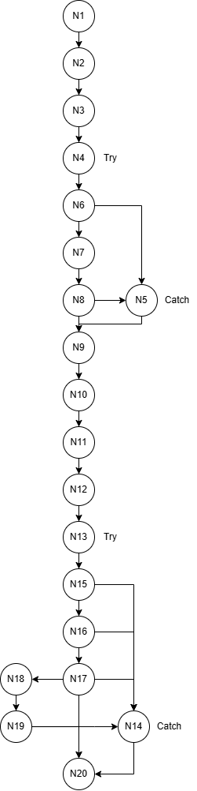

## Exercício - Teste Caixa Branca - AS406TSN3 - UX/UI e Testes de Software
Atividade feita para a matéria de UX/UI e Testes de Software (AS406TSN3) ministrada pelo Professor Daniel Ohata na Facens.

### O que está sendo feito
A partir do código base recebido pelo professor, está sendo feita a análise de erros e reportagem de possíveis correções, além da ilustração do fluxo do código a partir de um grafo de fluxo junto com seu cálculo de complexidade ciclomática e representação de caminhos básicos. Além disso, foi adicionado comentários no código base para permitir a criação de um JavaDoc a partir do código.

O código base se tratava de uma classe Usuário com a capacidade de se conectar a um banco de dados MySql (a partir do método conectarDb) e verificar se existe um usuário com as credênciais passadas (com o método verificarUsuário).

### Erros encontrados no código original
- O código apresenta uma organização inconsistente, como a falta de quebra de linhas e indentações em certos lugares, e de espaçamento insconsistente.
- Estilo de nomenclatura inconsistente, com termos sendo utilizados ambos em inglês e português.
- A importação do Driver de conexão `Class.forName("com.mysql.jdbc.Driver").newInstance()` é considerada depreciada, substituir por `Class.forName("com.mysql.jdbc.Driver").newInstance()`.
- A url de conexão do banco de dados apresenta credenciais hard-coded, seria melhor adicioná-las em variáveis de ambientes ou secrets e importar dentro do código.
- Ao rodar `conn = DriverManager.getConnection(url);`, dá exceção `InvalidConnectionAttributeException` que pode ser devido às novas versões do conector, para resolver foi necessário adicionar `&useTimezone=true&serverTimezone=UTC` a url de conexão.
- O código possui try/catch que não fazem nada para o handling de exceções no catch. Além disso, os catches no código estão capturando a classe `Exception`, o que significa que não existe handling especiais para exceções específicas.
- Na definição da variável `sql` dentro do método `verificarUsuario()`, a definição pode ser simplificada ao adicionar o statement SQL inteiro dentro de uma única string, ou text block caso deseje manter a quebra de linha dentro do código. Além disso, existe a separação das aspas simples do resto da string nas linhas `sql += "where login = " + "'" + login + "'";` e `sql += " and senha = " + "'" + senha + "'";`, quando pode-se inserir-lás dentro da string.
- As variáveis `st` e `rs`não possuem boa nomenclatura, podendo ser renomeadas para `statement` e `resultSet` para maior clareza.

### Grafo de Fluxo
Assumindo que a execução começa a partir do método verificarUsuário, segue o grafo de fluxo abaixo:

#### Nós:
- Nó 1: `String sql = "";`  (início verificarUsuário)
- Nó 2: `Connection conn = conectarBD();`
- Nó 3: `Connection conn = null;`  (início conectarBD)
- Nó 4: `try {`
- Nó 5: `catch (Exception e) { }`
- Nó 6: `Class.forName("com.mysql.Driver.Manager").newInstance();`
- Nó 7: `String url = "jdbc:mysql://127.0.0.1/test?user=lopes&password=123";`
- Nó 8: `conn = DriverManager.getConnection(url);`
- Nó 9: `return conn;` (fim conectarBD)
- Nó 10: `sql += "select nome from usuarios ";`
- Nó 11: `sql += "where login = " + "'" + login + "'";`
- Nó 12: `sql += " and senha = " + "'" + senha + "'";`
- Nó 13: `try{`
- Nó 14: `catch (Exception e) { }`
- Nó 15: `Statement st = conn.createStatement();`
- Nó 16: `ResultSet rs = st.executeQuery(sql);`
- No 17: `if(rs.next()) {`
- Nó 18: `result = true;`
- Nó 19: `nome = rs.getString("nome");}`
- Nó 20: `return result;` (fim verificarUsuário)

### Arestas:
- De N1 para N2
- De N2 para N3
- De N3 para N4
- De N4 para N6
- De N6 para N7 (executado com sucesso)
- De N6 para N5 (exceção)
- De N7 para N8
- De N8 para N9 (executado com sucesso)
- De N8 para N5 (exceção)
- De N5 para N9
- De N9 para N10
- De N10 para N11
- De N11 para N12
- De N12 para N13
- De N13 para N15
- De N15 para N16 (executado com sucesso)
- De N15 para N14 (exceção)
- De N16 para N17 (executado com sucesso)
- De N16 para N14 (exceção)
- De N17 para N18 (caminho verdadeiro)
- De N17 para N20 (caminho falso)
- De N17 para N14 (exceção)
- De N18 para N19
- De N19 para N20 (executado com sucesso)
- De N19 para N14 (exceção)
- De N14 para N20

### Complexidade ciclomática
**M = 26 - 20 + 2 * 1 = 4**

Onde:
- 26 é a quantidade de arestas
- 20 é a quantidade de nós
- 1 é a quantidade de programas

### Caminhos Básicos
- N1 → N2 → N3 → N4 → N6 → N7 → N8 → N9 → N10 → N11 → N12 → N13 → N15 → N16 → N17 → N20 (N17 é falso)
- N1 → N2 → N3 → N4 → N6 → N7 → N8 → N9 → N10 → N11 → N12 → N13 → N15 → N16 → N17 → N18 → N19 → N20 (N17 é verdadeiro)
- N1 → N2 → N3 → N4 → N6 → N5 → N9 → N10 → N11 → N12 → N13 → N15 → N14 → N20 (exceção N5)
- N1 → N2 → N3 → N4 → N6 → N7 → N8 → N5 → N9 → N10 → N11 → N12 → N13 → N15 → N14 → N20 (exceção N8)